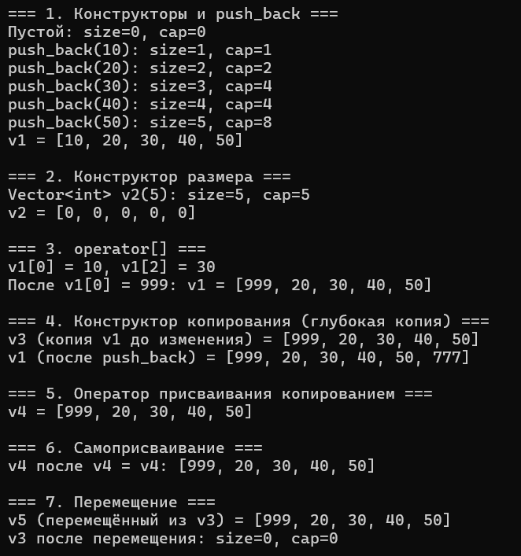
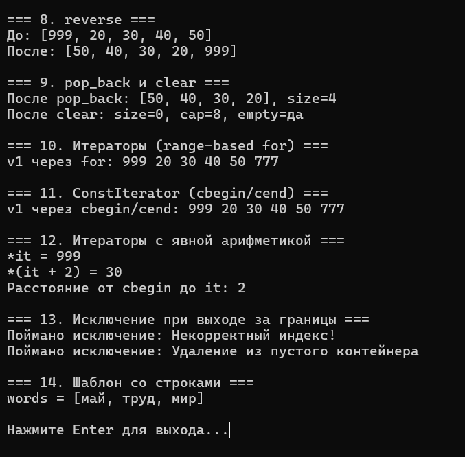

# Лабораторная работа №3: Шаблонный класс Vector – аналог std::vector

**Студент:** Лещинский П.А.

**Группа:** ПИЖ-б-о-25-2(2)

**Вариант:** 2

**Дисциплина:** «Алгоритмы и структуры данных»

**Тема:** «Реализация динамического массива (аналог vector). Итераторы»

---

## Цель работы

1. Реализовать шаблонный класс `Vector<T>` – аналог `std::vector` – с нуля.
2. Освоить управление динамической памятью: выделение, расширение, освобождение.
3. Закрепить «правило трёх» (деструктор, конструктор копирования, оператор присваивания) и освоить «правило пяти» (конструктор и оператор перемещения).
4. Реализовать итераторы для поддержки range-based for и STL-совместимости.
5. Провести амортизированный анализ операции `push_back`.

---

## Теоретическая часть

**Динамический массив** – структура данных, хранящая элементы в непрерывной области памяти, размер которой определяется во время выполнения. В отличие от статического массива (размер известен на этапе компиляции, память на стеке), динамический выделяется в куче через `new[]` и освобождается через `delete[]`.

Класс `Vector<T>` хранит три поля: указатель `data` на блок в куче, размер `sz` (сколько элементов лежит) и ёмкость `cap` (сколько помещается). Всегда `sz ≤ cap`.

**Удвоение ёмкости.** При переполнении блок не растёт на фиксированное число, а удваивается. Это даёт амортизированную сложность O(1) для `push_back`: реаллокации происходят на степенях двойки, суммарное количество копирований за N вставок – O(N), а не O(N²).

**Правило трёх** – если класс владеет ресурсом, ему нужны собственные деструктор, конструктор копирования и оператор присваивания копированием. Иначе компилятор сгенерирует поверхностное копирование, и два объекта будут владеть одним блоком – двойное освобождение.

**Правило пяти** добавляет конструктор перемещения и оператор присваивания перемещением. Они позволяют забирать ресурсы у временного объекта за O(1) вместо копирования. Помечаются `noexcept`, чтобы STL использовал перемещение вместо копирования при реаллокациях.

**Итераторы.** Для `Vector<T>` итератором может быть обычный указатель `T*`, потому что элементы лежат подряд. `begin()` – указатель на первый, `end()` – на «за последним».

**RAII** – принцип: захват ресурса в конструкторе, освобождение в деструкторе. Деструктор вызывается гарантированно при выходе из области видимости.

---

## Постановка задачи

Продвинутый уровень, вариант 2: реализовать класс `Vector<T>` с поддержкой «правила пяти», итераторами и дополнительной функциональностью. Дополнительная функциональность по варианту 2 продвинутого уровня – реализация `const_iterator`.

---

## Листинг программы с комментариями

Ссылка на файл в репозитории:

https://github.com/Fanatol/cpp-labs/blob/main/lab3-3/task.cpp

---

## Результаты работы

Результаты выполнения программы представлены на скриншотах.

<b>Рисунок 1 – Вывод программы часть 1</b>

<b>Рисунок 2 – Вывод программы часть 2</b>

---

## Анализ сложности операций

| Операция | Сложность | Обоснование |
|----------|-----------|-------------|
| `push_back` | O(1) амортизированно | Обычно запись в свободный слот, при переполнении – реаллокация O(n). Удвоение даёт константную амортизированную сложность. |
| `pop_back` | O(1) | Уменьшение счётчика `sz`, память не освобождается. |
| `operator[]` | O(1) | Адрес вычисляется как `data + index` за одно действие. |
| `size`, `capacity`, `empty` | O(1) | Возврат полей. |
| `clear` | O(1) | Установка `sz = 0`, память не трогается. |
| `reserve` | O(n) при росте, O(1) иначе | Копирование `sz` элементов в новый блок. |
| `reverse` | O(n) | Проход до середины, обмен элементов. O(1) по памяти. |
| `swap` | O(1) | Три обмена указателей и чисел. |
| Конструктор копирования | O(n) | Выделение нового блока + копирование `sz` элементов. |
| Оператор присваивания копированием | O(n) | Через copy-and-swap. |
| Конструктор перемещения | O(1) | Перекидывание указателя, без копирования. |
| Оператор присваивания перемещением | O(1) | Освобождение своих + перекидывание чужих. |
| Деструктор | O(n) | Вызов деструкторов для элементов (для сложных типов). |
| `begin`, `end`, `cbegin`, `cend` | O(1) | Возврат указателей. |
| `ConstIterator` (все операции) | O(1) | Работа с указателем. |

---

## Ответы на контрольные вопросы

<b>1. Почему динамический массив называется «динамическим»?</b>

Потому что его размер определяется во время выполнения программы, а не на этапе компиляции. В отличие от статического массива, который выделяется на стеке и имеет фиксированный размер, динамический выделяется в куче через `new[]` и может менять размер во время работы.

<b>2. Что такое ёмкость (capacity) и чем она отличается от размера (size)?</b>

`size` – сколько элементов реально лежит в векторе. `capacity` – сколько элементов помещается в выделенном блоке без перевыделения. Всегда `size ≤ capacity`. Разница – это «запас» для будущих вставок без реаллокации.

<b>3. Почему при расширении массива ёмкость удваивается, а не увеличивается на фиксированное число?</b>

При увеличении на константу каждая вставка в среднем требует копирования всех элементов, что даёт O(n) на операцию. При удвоении реаллокации происходят на степенях двойки, и суммарное количество копирований за N вставок – O(N), то есть O(1) амортизированно на одну вставку.

<b>4. Какова амортизированная сложность операции push_back? Почему?</b>

O(1). Большинство вставок происходит без реаллокации (O(1)), изредка случается реаллокация (O(n)).

<b>5. Что такое «правило трёх»? Когда оно применяется?</b>

Если класс определяет собственный деструктор, ему нужны также конструктор копирования и оператор присваивания копированием. Применяется к классам, владеющим ресурсом (динамической памятью, файлами, дескрипторами). Иначе поверхностное копирование приведёт к двойному освобождению.

<b>6. Что такое «правило пяти»? Чем оно отличается от «правила трёх»?</b>

Правило пяти – это правило трёх плюс конструктор перемещения и оператор присваивания перемещением. Появилось в C++11 вместе с rvalue-ссылками. Позволяет не копировать данные из временного объекта, а забирать его ресурсы за O(1).

<b>7. В чём разница между конструктором копирования и оператором присваивания?</b>

Конструктор копирования создаёт **новый** объект из существующего. Оператор присваивания копирует данные в **уже существующий** объект, которому сначала нужно освободить старые ресурсы. Оператор присваивания должен защищаться от самоприсваивания.

<b>8. Зачем нужна проверка if (this != &other) в операторе присваивания?</b>

Защита от самоприсваивания (`v = v`). Без неё при копировании мы бы сначала освободили данные `this`, а потом пытались бы скопировать из уже удалённых данных – неопределённое поведение. В перемещающем присваивании та же проблема.

<b>9. Что такое итератор? Как он связан с указателем?</b>

Итератор – объект, который указывает на элемент контейнера и позволяет перебирать элементы. Для непрерывного массива итератор – это просто указатель `T*`. Указатель поддерживает всё необходимое: `*it`, `++it`, `it != end`, `it + n`, `it - other`.

<b>10. Зачем нужны методы begin() и end()?</b>

`begin()` возвращает итератор на первый элемент, `end()` – на «за последним» (маркер конца диапазона). Вместе они задают диапазон для обхода. `end()` – не последний элемент, а позиция после него, чтобы цикл `it != end` корректно останавливался.

<b>11. Как реализовать range-based for для своего контейнера?</b>

Достаточно реализовать методы `begin()` и `end()`. Компилятор разворачивает `for (T x : v)` в цикл с этими методами и операторами `!=`, `++`, `*`. Ничего больше не требуется.

<b>12. Что такое «глубокое копирование»? Чем оно отличается от «поверхностного»?</b>

Глубокое копирование – при копировании объекта выделяется новый ресурс, и данные копируются в него. Поверхностное – копируются только указатели, и два объекта начинают владеть одним ресурсом. Для класса с динамической памятью поверхностное копирование приводит к двойному освобождению при уничтожении.

<b>13. Что такое семантика перемещения и зачем она нужна?</b>

Семантика перемещения позволяет не копировать данные из временного объекта, а забирать его ресурсы. Это O(1) вместо O(n). Нужна для эффективности: возврат из функций по значению, реаллокации контейнеров, перестановки объектов в алгоритмах.

<b>14. Почему конструктор перемещения помечается noexcept?</b>

Если перемещение может выбросить исключение, STL-контейнеры предпочтут копирование вместо перемещения при реаллокации – потому что в случае исключения нельзя откатить частично перемещённое состояние. `noexcept` – обещание, что исключения не будет, и тогда STL использует быстрое перемещение.

<b>15. Как правильно освобождать память в деструкторе?</b>

Через `delete[]` для массивов (парный к `new[]`) или `delete` для одиночных объектов. После освобождения обнулить указатель. Не вызывать `delete[]` дважды. Проверка на `nullptr` не нужна – `delete[] nullptr` безопасен.

---

## Вывод

В ходе работы реализован шаблонный класс `Vector<T>` – аналог `std::vector`. Освоено управление динамической памятью: выделение в конструкторах, освобождение в деструкторе, реаллокация через `reserve` с удвоением ёмкости. Реализовано «правило пяти»: конструктор копирования, оператор присваивания копированием, конструктор перемещения и оператор присваивания перемещением. Реализованы итераторы `begin`/`end`, а также отдельный класс `ConstIterator` с полным набором операций. Проведён анализ сложности. Обработаны граничные случаи: выход за границы в `operator[]`, удаление из пустого вектора, самоприсваивание.

---

## Ссылка на Git-репозиторий

https://github.com/Fanatol/cpp-labs/tree/main/lab3-3
